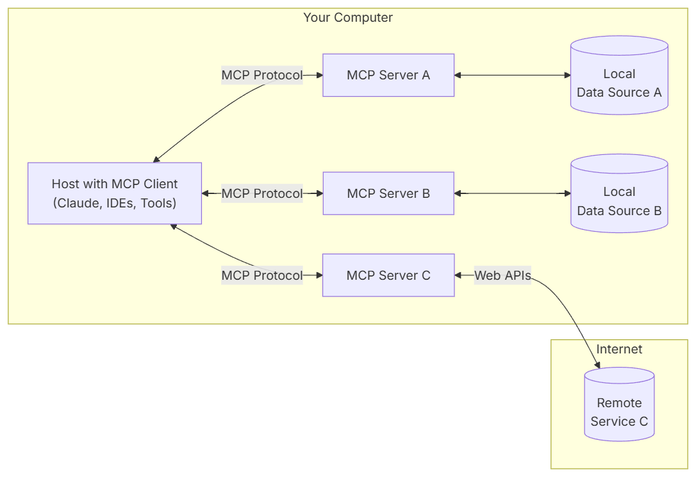
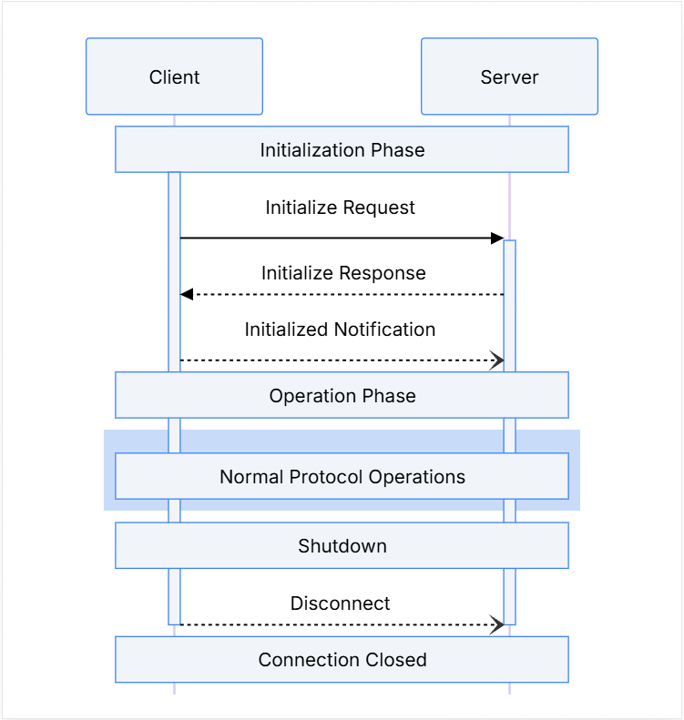
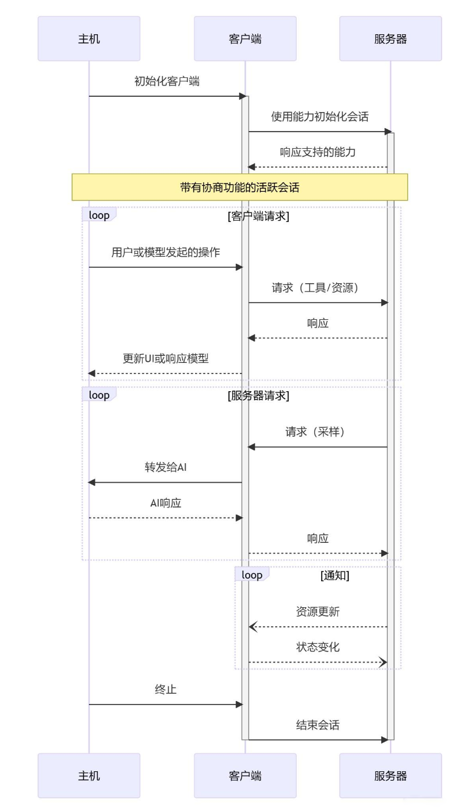
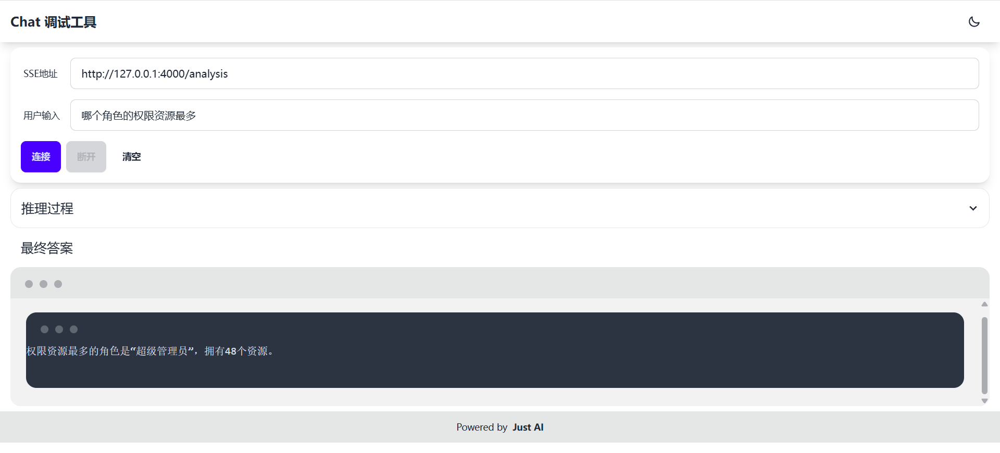

## Getting Started

**Algorithmic Learning Graybeard - 星星点灯，基于MCP协议实现智能查询。**

 *基于智能AI系统构建RAG-MCP全流程闭环，依托MCP Server数据库的实时数据融合与语义索引能力，通过MCP协议实现自然语言到结构化查询的智能转换。
 可用于辅助企业/团队进行技术研发、产品设计等支撑等工作。*

> **🌟该项目如对您有帮助，欢迎点赞🌟**

## 系统组成及文档

[中文文档](README.md) | [English](README_en.md)
<br>
<br>
> 👉代码地址：[github](https://github.com/chenlinyang/alg-mcp) 或 [gitee](https://gitee.com/chenlinyang/alg-mcp)

参考架构：
- [Claude MCP协议](https://www.claudemcp.com/specification)

- [MCP SDK介绍](https://modelcontextprotocol.io/introduction)

- 总体架构<br>


- 生命周期<br>


- 操作步骤<br>


## 功能点

* MCP服务端
* MCP客户端
* Chat演示地址：<br>
http://localhost:4000/
- 天气查询

- 数据库操作


## 示例接入的模型：
* Zhipu-AI

* 也可以根据个人喜好接入其他模型：<br>
DeepSeek、ChatGPT 3.5、通义千问、文心一言、ollama

## 技术栈

该仓库为后端服务

MCP 技术栈：

* jdk17
* springboot 3.4.4
* [langchain4j 1.0.0-beta3](https://github.com/langchain4j/langchain4j)
* **mcp-server** 利用自定义注解，实现MCP协议：<br>
initialize、tools/call、tools/list、notifications/initialized、prompts/list、prompts/get 
* **mcp-client** 使用RAG自定义QueryTransformer，读取MCP server prompt实现NPL2SQL功能

## 如何运行

### mcp-server配置

**a. 配置数据库连接**

* 数据库(MySQL)
```yaml
spring:
  datasource:
    type: com.zaxxer.hikari.HikariDataSource
    url: jdbc:mysql://<ip>:<port>/<database_name>?characterEncoding=utf8&serverTimezone=GMT%2B8&useSSL=false
    driver-class-name: com.mysql.cj.jdbc.Driver
    username: <username>
    password: <password>
```

**b. 配置第三方天气API**
* 申请和风天气的API-KEY和API-HOST<br>
[申请地址](https://id.qweather.com/#/login)

```yaml
weather:
  api:
    host: <api-host>
    api-key: <api-key>
```

### mcp-client配置

**a. 配置mcp-server连接**

* SSE Endpoint
```yaml
mcp:
  server:
    sse-url: http://localhost:3002/sse
```

**b. 配置大模型**
* 大模型api-key和model配置

```yaml
zhipu-ai:
  api-key: <api-key>
  model: <model>
```