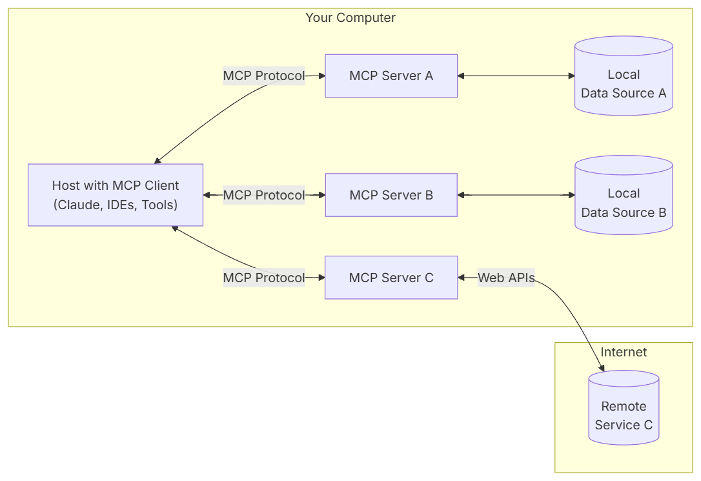

## Getting Started

**Algorithmic Learning Graybeard - Stars Lighting,enabling intelligent querying based on the MCP protocol.**

*The intelligent AI system constructs a full-process closed-loop of RAG-MCP, leveraging the real-time data integration and semantic indexing capabilities of the MCP Server database. Through the MCP protocol, it achieves intelligent conversion from natural language to structured queries.
This framework can assist enterprises/teams in conducting technology research and development, product design, and other supportive tasks.*

> **🌟If this project has been helpful to you, your endorsement through a "Star" would be greatly appreciated.🌟**

## System Composition and Documentation

[Chinese](README.md) | [English](README_en.md)
<br>
<br>
> 👉Resources repository:[github](https://github.com/chenlinyang/alg-mcp) or [gitee](https://gitee.com/chenlinyang/alg-mcp)

Reference Architecture:
- [Claude MCP Protocol](https://www.claudemcp.com/specification)

- [MCP SDK Introduction](https://modelcontextprotocol.io/introduction)

- General Architecture<br>
  

- Lifecycle<br>
  

- Operation<br>
  

## Features

* MCP server
* MCP client
* Chat demo URL:<br>
  http://localhost:4000/
- Weather Retrieval
  
- Database Operation
  

## Example access LLM:
* Zhipu-AI

* Other LLMs can also be integrated according to personal preferences:<br>
DeepSeek、ChatGPT 3.5、Tongyi Qianwen、ERNIE Bot、ollama

## Technology stack

This repository is for the backend service

Technology stack:

* jdk17
* springboot 3.4.4
* [langchain4j 1.0.0-beta3](https://github.com/langchain4j/langchain4j)
* **mcp-server** Customize annotations to implement MCP protocol:<br>
initialize、tools/call、tools/list、notifications/initialized、prompts/list、prompts/get
* **mcp-client** Implement NL2SQL functionality by customizing a QueryTransformer with RAG to retrieve prompts from the MCP server

## How to run

### mcp-server configuration

**a. Configure database connection**

* Database(MySQL)
```yaml
spring:
  datasource:
    type: com.zaxxer.hikari.HikariDataSource
    url: jdbc:mysql://<ip>:<port>/<database_name>?characterEncoding=utf8&serverTimezone=GMT%2B8&useSSL=false
    driver-class-name: com.mysql.cj.jdbc.Driver
    username: <username>
    password: <password>
```

**b. Configure third-party weather API**
* Application Hefeng Weather API-KEY and API-HOST<br>
  [Hefeng Weather URL](https://id.qweather.com/#/login)

```yaml
weather:
  api:
    host: <api-host>
    api-key: <api-key>
```

### mcp-client configuration

**a. Configure mcp-server connection**

* SSE Endpoint
```yaml
mcp:
  server:
    sse-url: http://localhost:3002/sse
```

**b. Configure LLM**
* LL api-key and model configuration

```yaml
zhipu-ai:
  api-key: <api-key>
  model: <model>
```