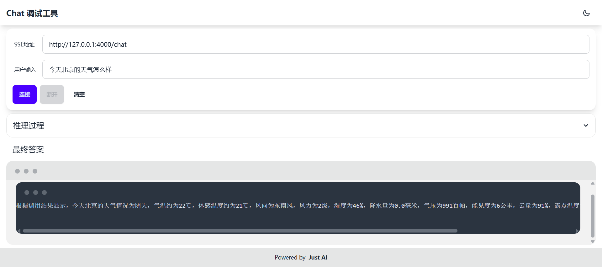
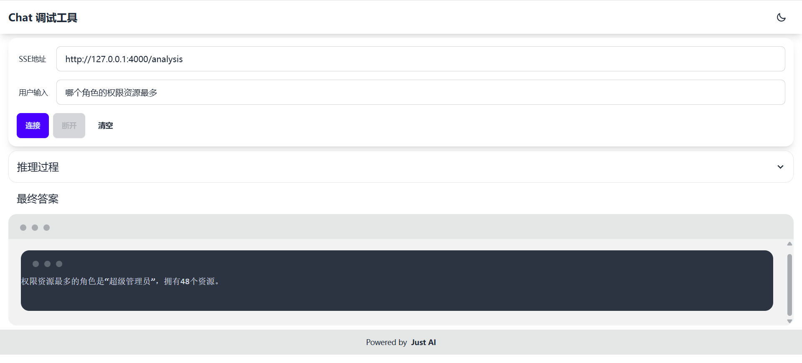

## Getting Started

**Algorithmic Learning Graybeard - Stars Lighting, enabling intelligent querying based on the RAG+MCP dual-engine architecture.**

*Building upon the foundation of Large Language Models (LLMs) and leveraging the MCP Server's capabilities in database data fusion and semantic indexing, we establish a dual-engine architecture with synergistic RAG-MCP collaboration. Through intelligent syntax parsing and query mapping, this system achieves precise conversion from natural language to structured queries, ultimately forming a closed-loop technical framework.
It can be used to assist enterprises/teams in technical research and development, product design, etc.*

> **🌟If this project is helpful to you, please give it a star.🌟**

## System Composition and Documentation

[Chinese](README.md) | [English](README_en.md)
<br>
> 👉Resources repository: [github](https://github.com/chenlinyang/alg-mcp) or [gitee](https://gitee.com/chenlinyang/alg-mcp)

If you have thousands of data catalogs and hundreds of millions of data facts, you can extend and optimize this project for enhanced data retrieval or analytics capabilities.

Architecture Reference:
- [Claude MCP Protocol](https://www.claudemcp.com/specification)

- [MCP SDK Introduction](https://modelcontextprotocol.io/introduction)

- General Architecture<br>
  

- Lifecycle<br>
  

- Operations<br>
  

## Features

* MCP server

* MCP client

* Chat demo URL:<br>
  http://localhost:4000/

- Weather Retrieval
> Open API Interoperability



- Database Operations
> Achieve seamless data aggregation, ranking, and stratified sampling in one SQL execution



## Connected LLM
* Zhipu-AI

* Other LLMs can also be integrated according to personal preferences:<br>
  Supports DeepSeek, ChatGPT 3.5, Tongyi Qianwen, ERNIE Bot, Ollama, etc.

## Technology stack

This repository is for the backend service

Technology stack:

* jdk 17
* springboot 3.4.4
* [langchain4j 1.0.0-beta3](https://github.com/langchain4j/langchain4j)
* **mcp-server** Customize annotations to implement MCP protocol. The completed interfaces are:<br>
initialize, tools/call, tools/list, notifications/initialized, prompts/list, prompts/get, etc.
* **mcp-client** Implement NL2SQL functionality by customizing a QueryTransformer with RAG to retrieve prompts from the MCP server

## How to run

### mcp-server configuration

**a. Configure database connection**

* Database(MySQL)
```yaml
spring:
  datasource:
    type: com.zaxxer.hikari.HikariDataSource
    url: jdbc:mysql://<ip>:<port>/<database_name>?characterEncoding=utf8&serverTimezone=GMT%2B8&useSSL=false
    driver-class-name: com.mysql.cj.jdbc.Driver
    username: <username>
    password: <password>
```

* Supports relational databases including PostgreSQL, Oracle, SQL Server, H2, and others.<br>
  Configuration reference: [spring-boot-data-jdbc](https://docs.spring.io/spring-boot/docs/current/reference/html/data.html#data.sql.jdbc)

**b. Configure third-party weather API**
* Application Hefeng Weather API-KEY and API-HOST<br>
  [Hefeng Weather](https://id.qweather.com/#/login)

```yaml
weather:
  api:
    host: <api-host>
    api-key: <api-key>
```

### mcp-client configuration

**a. Configure mcp-server connection**

* SSE Endpoint
```yaml
mcp:
  server:
    sse-url: http://localhost:3002/sse
```

**b. Configure LLM**
* LLM api-key and model configuration

```yaml
zhipu-ai:
  api-key: <api-key>
  model: <model>
```